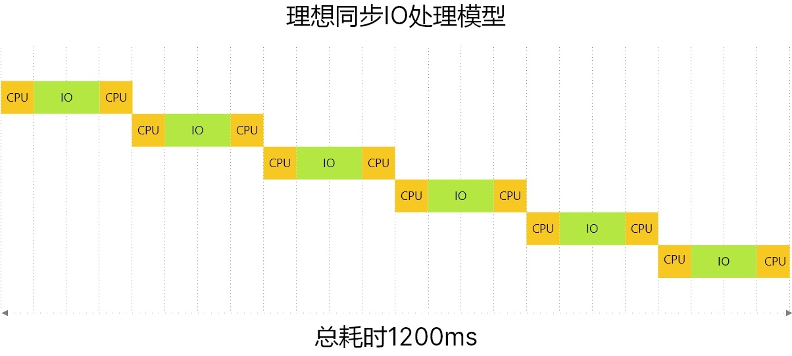
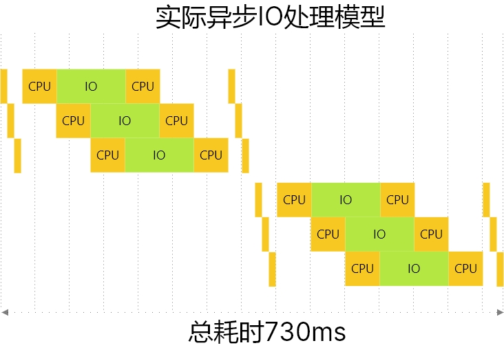
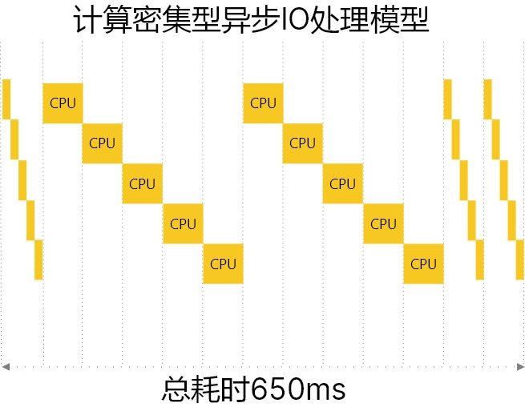
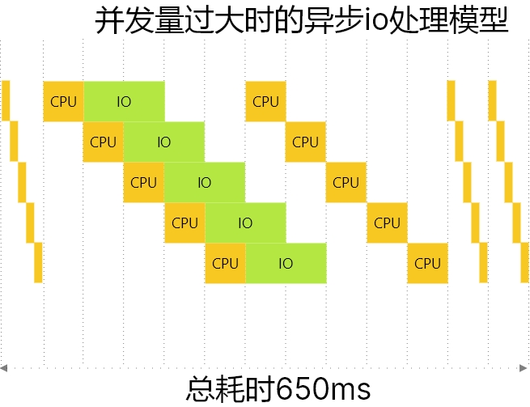
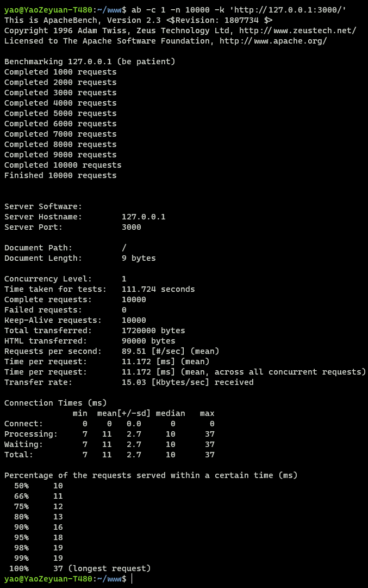
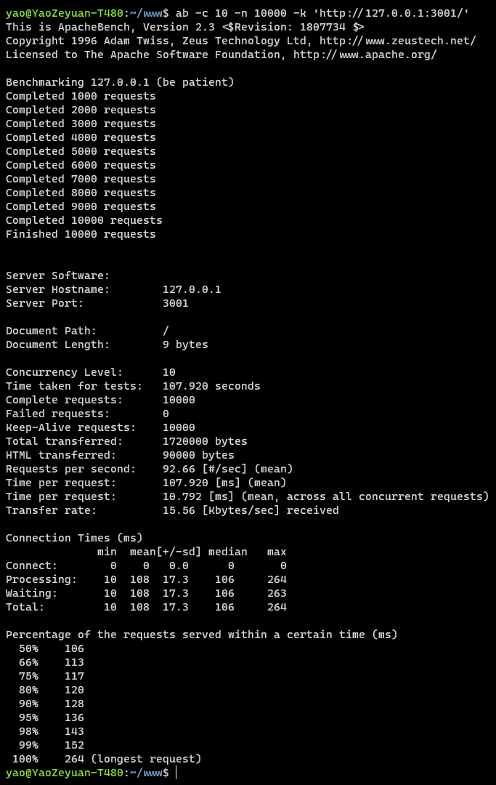
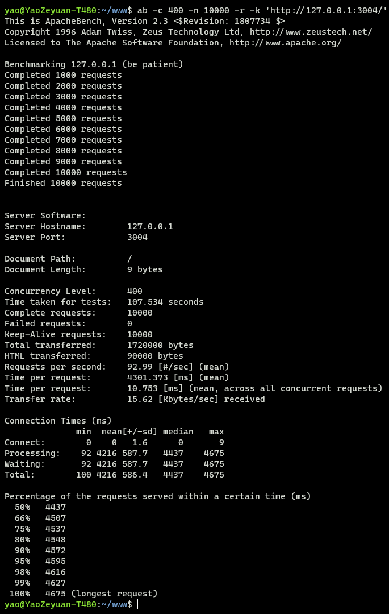
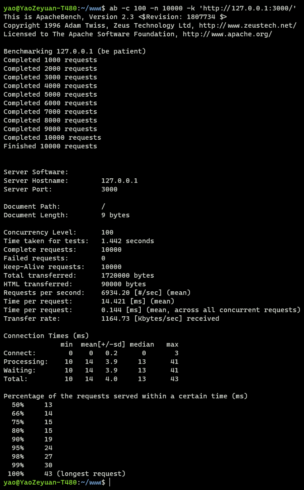
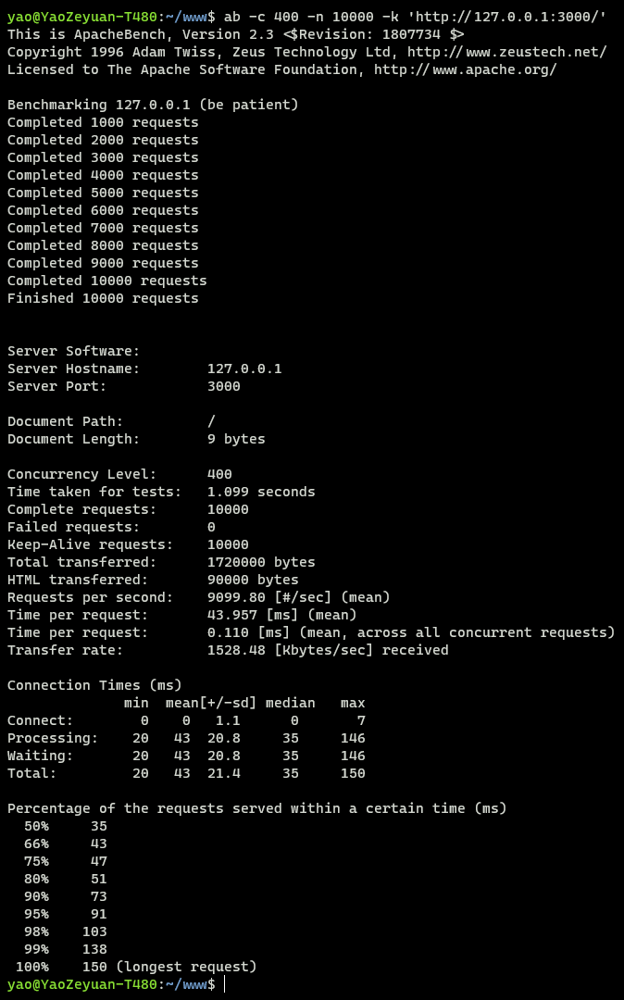

> 当抵达 Node 服务的请求数达到理论最高吞吐量时, 单个请求的响应时间和所有请求平均响应时间会是什么关系?
>
> 答: 所有请求平均响应时间一切如常, 单个请求响应时间突然飞涨
>
> 为什么是这样?

周末接到三次报警, 线上 Node 服务突然出现大量接口 30 秒超时. 但每次都是刚连上 vpn, 报警就消失. 期间没有上线操作, 流量不大且平稳, 报错的是普通接口逻辑流程正常, 99.5%的请求响应时间在 100ms 以内, 服务器 CPU 使用率稳定在 30% 且无波动, 内存使用无波动, 硬盘读写无波动. 但就是突然几千个请求响超时, 故障期间连服务器上的静态资源文件也拉不下来, 然后自动恢复正常...why?

## 排查步骤

### 问题表现

需要先确认问题表现, 在这次报警中, 问题表现如下

1.  服务短时间内出现大量请求超时, 30 秒内无响应, 504 报错
2.  在服务故障期间(排查期间正好赶上一次故障), 访问服务器上的静态资源文件(只需要服务进程进行简单读取磁盘)也没有响应, 说明服务进程处于"卡死"状态
3.  代码发版
    1.  最近 7 天无发版操作
4.  通过查询日志, 报错前 3 天内没有发生过重启, 报错期间也没有进程重启事件
5.  历史报警
    1.  5 天前晚 7 点左右也有一次 504 报警, 1 分钟后解除, 当时排查后认为是网络抖动, 没有注意
6.  服务器
    1.  服务器 CPU 使用率无波动, 稳定在 30% 左右
    2.  服务进程 CPU 使用率大致在 16~25% 之间
    3.  磁盘 io 无波动
    4.  内存使用无波动, 且有较大冗余空间
7.  请求流量
    1.  日常 QPS 6~10
    2.  故障期间(11:05:00~11:20:00)
        1.  最高 QPS 67, 持续 1 秒, 随后恢复正常
        2.  平均每分钟有一次 QPS 为 20 的并发, 但只维持 1 秒
8.  接口响应时间
    1.  日常接口响应时间 40~50ms
    2.  故障期间(11:05:00~11:20:00)
        1.  每分钟有一批接口响应时间在 1~3 秒, 只持续 1 秒
        2.  故障期间接口响应时间快速升高, 然后达到 30s, 持续 60s 后快速下降回正常状态
9.  线上服务器日志
    1.  服务器本身只有 200 的日志记录, 通过 grep 遍历搜索, 没有 504 超时记录.
    2.  504 超时记录只出现在 Nginx 日志中
    3.  看到的记录响应耗时大部分为 0, 偶有 40~100 的情况
10. 服务器情况
    1.  **线上三台服务器几乎同步发生异常, 然后同步恢复**
11. 日常接口响应时间
    1.  每天大约有 1000 个请求响应时间在 300ms 以上, 但都是集中出现一阵后消失, 没有规律
12. 原始请求日志

    ```java

    请求时间  响应时长  请求接口
    09:20:25 0.091   /api/xxx/list
    09:20:25 0.036   /api/xxx/list
    09:20:25 0.040   /api/xxx/list
    09:20:25 0.036   /api/xxx/list
    09:20:25 0.045   /api/xxx/list
    09:20:25 0.054   /api/xxx/list
    09:20:25 0.151   /api/xxx/list
    09:20:25 0.036   /api/xxx/list
    09:20:25 0.106   /api/xxx/list
    09:20:26 0.046   /api/xxx/list
    09:20:26 0.061   /api/xxx/list
    09:20:26 0.056   /api/xxx/list
    09:20:26 0.042   /api/xxx/list
    09:20:28 2.177   /api/xxx/list
    09:20:28 0.811   /api/xxx/list
    09:20:28 2.377   /api/xxx/list
    09:20:28 0.929   /api/xxx/list
    09:20:29 2.916   /api/xxx/list
    09:20:30 2.735   /api/xxx/list
    09:20:40 14.397  /api/xxx/list
    09:20:46 19.809  /api/xxx/list
    09:20:46 1.723   /api/xxx/list
    09:20:48 21.274  /api/xxx/list
    09:20:48 1.063   /api/xxx/list
    09:20:49 3.777   /api/xxx/list
    09:20:49 22.506  /api/xxx/list
    09:20:49 21.235  /api/xxx/list
    09:20:49 22.760  /api/xxx/list
    09:20:49 22.239  /api/xxx/list
    09:20:49 22.534  /api/xxx/list
    09:20:50 21.391  /api/xxx/list
    09:20:50 14.277  /api/xxx/list
    09:20:50 21.354  /api/xxx/list
    09:20:50 15.353  /api/xxx/list
    09:20:50 22.900  /api/xxx/list
    09:20:50 20.077  /api/xxx/list
    09:20:50 20.772  /api/xxx/list
    09:20:50 10.949  /api/xxx/list
    09:20:50 16.745  /api/xxx/list
    09:20:50 22.802  /api/xxx/list
    09:20:50 22.125  /api/xxx/list
    09:20:56 30.000  /api/xxx/list
    09:20:57 30.001  /api/xxx/list
    09:20:57 30.001  /api/xxx/list
    09:20:58 30.000  /api/xxx/list
    09:20:59 30.000  /api/xxx/list
    09:20:59 30.000  /api/xxx/list
    09:20:59 30.001  /api/xxx/list
    09:20:59 30.000  /api/xxx/list
    ```

### 代码问题

对于线上服务故障, 第一反应就是检查代码本身是否有问题. 由于是新业务, 排查日志发现 90%的请求都在访问`/api/xxx/list`, 所以检查起来比较简单. 经审核, 代码没有问题, 也没有明显存在风险的点. 考虑到如果代码真有问题, 那之前一定会有报错记录. 于是翻查请求历史日志, 发现请求都能在 50ms 内正常响应, 说明代码本身确实没毛病.

### MySQL 慢查询 / 远程服务无响应

排除代码本身问题后, 紧接着需要考虑的是 MySQL 集群故障/ 慢查询的可能. 如果 MySQL 调用超时, 那 await 等待远程接口响应的 Node 服务自然也会超时.但这个想法很快被排除掉了, 主要是两个原因:

1.  假设是 MySQL 集群故障, 查询无响应. 那么同一时间段内, 依赖 MySQL 集群的其他服务必然也会报错, 不会只有我们一个服务故障. 但现实是故障期间只有我们的服务出现了 504 超时错误.
2.  如果请求卡在等待远程调用中, 由于 Node 使用的是异步模型, 服务进程并不会阻塞在等待接口响应上. 此时其他接口/静态文件(不依赖外部接口)应该可以继续访问. 但在问题描述中可以看到, 故障期间静态文件也无法访问. 所以问题更像是整个服务进程失去了响应, 而非 MySQL 集群有问题.

MySQL 问题排除.

### 服务器问题

有没有可能是服务器本身挂了呢? 但这也没可能:

1.  故障期间服务器上其他应用响应正常
2.  位于三台服务器上的进程几乎同步故障, 说明是三台机器间共有的部分出错, 不像是单台服务器故障

### 服务进程本身问题

代码没有问题, MySQL 没有问题, 服务器也没有问题. 那只能是服务进程本身出了毛病.

通过故障期间每秒接口响应数(QPS)+接口响应时长合并图可以看到, 接口响应时长和 QPS 明显相关, 当 QPS 变大时, 接口响应时长一般都会随之增加, 而增大到极值(11:17~11:19), 响应时长突破 30s, 对应的就是线上 Nginx 504 报错. 但是, 服务器压力大导致接口超时可以理解, 但为什么静态资源请求也跟着超时? 为什么会这样?


# 异步模型的脆折风险

所有这些, 需要从 io 请求处理模型说起.



传统 io 模型是串行模式, 一个一个处理请求. 可以看到, 处理 6 个请求时, 总耗时 1200ms. 大量时间浪费在 io 等待中.


为了避免浪费, 提升服务器吞吐率, 异步 io 模型应运而生. 异步的基本思路是时间复用, 在等待 io 的期间让 CPU 去处理其他请求, 从而充分利用计算资源. 可以看到, 在理想情况下, 异步模型处理 6 个请求只需要 650ms.

不过, 这是理想情况. 在实际应用中, 请求的计算部分和 io 等待部分会交织在一起, 由于每个部分消耗时间都不太长, 因此会形成**时间片**的效果. 只有执行完所有时间片, 一个任务才能执行完成.


而当多个请求同时到达 Node 进程时, Node 的任务队列会变成下边这样: 不同请求的回调在任务队列中进行等待执行.


由于接口响应过程被异步等待被拆分成一个个子任务, 形成了**细碎的时间片**, 接口的异步处理模型如下图所示. 当多个请求同时到达时, 由于 io 等待+任务队列调度的效果, Node 倾向于在请求间平均分配时间片, **对同一接口同时到达的请求倾向于同时完成**. 但可以看出, 即使切换时间片本身需要时间, 导致单个请求响应时长增加, 但因为可以利用 io 等待时间, 异步模型仍然比串行模式要高效.



那如果待执行的任务没有 io 操作, 是**纯计算密集型请求**呢?

那就会悲剧. 如果是计算密集型请求, 异步模型的处理能力会回落到和串行模型同一水平, 甚至更差: **在串行模式下, 高并发时串行模式至少可以保证前几个接口的正常响应**, 后续接口由于等待时间过长才会超时报 504. 但在异步模型下, **由于在各个任务间不断进行调度, 所有任务的完成时间都差不多, 会导致最终没有一个请求可以正常响应, 所有任务一起 504 超时报错**

如下图所示



一般认为, web 服务是典型的 io 密集型场景, 大量时间消耗在 MySQL 通信与和其他接口交互中, 所以 Node 的异步模型天然适合用做 web 服务器. 但在特殊场景下, web 服务也会由 io 密集型退化为计算密集型: **当请求数量超过阈值, 请求提供的 io 等待时长不足以完成其他请求的 CPU 操作时**, 此时 CPU 就会变成服务的性能瓶颈. 由于所有请求都没有足够的 CPU 资源完成运算, 导致所有请求都`无法在可接受时间内响应`, 出现服务进程`"卡死"`的效果.

由于这个过程的临界点是`待处理请求所需的总CPU处理时长`大于`待处理请求所需的总IO时长`, 所以当问题发生时, 会有类似于钢板脆折的效果. 在临界点以下, 一切安好, 响应时长正常, 看不出有什么问题. 一旦超过临界点, 响应时长快速增加, 然后就是大规模 504 报错, 直到请求量降到临界点以下, 处理完所有挤压请求后, 一切又回归正常.



所以 Node 服务会有一个很特殊的现象: 绝大多数情况下表现正常, 但当并发量比最大容纳值稍微高一点, **所有接口**响应速度就会快速抬升(脆折), 但请求量只要降一点, 服务性能又会恢复正常. 整个表现非常反直觉, 但符合异步模型的原理.

# 实践验证

说了这么多, 实际测试一下.

压测框架使用 koa, 分别用`asyncSetTimeoutSleep`和`asyncCPUSleep`模拟 io 密集型和计算密集型请求, 压测工具使用 ApacheBench, 测试命令为`ab -c 1/10/100/400 -n 10000 -k 'http://127.0.0.1:3000/'`, `-n`指测试总数, 取 10000, `-c`指每轮测试并发请求数, 分别取 1/10/100/400 进行测试, 测试代码&实验结果如下

```javascript
// 测试代码
const Koa = require("koa");
const app = new Koa();

async function asyncSetTimeoutSleep(ms = 0) {
  await new Promise((reslove, reject) => {
    setTimeout(() => {
      reslove(true);
    }, ms);
  });
  return;
}

async function asyncCPUSleep(ms = 0) {
  await new Promise((reslove, reject) => {
    // 这里必须使用setTimeout模拟sleep, 否则Node会由于没有调度机会,只能按先后顺序处理请求
    // (接受请求1->处理请求1->响应请求1->接受请求2->处理请求2->响应请求2->...)
    // 此时异步模式降级为串行模式, 失去比较意义
    setTimeout(() => {
      // 运算150000次在我的机器上正好是1ms, 单纯用来模拟CPU密集型操作, 没有特别意义
      for (let i = 0; i < 1500000 * ms; i++) {}
      reslove(true);
    }, 0);
  });
  return;
}

app.use(async (ctx) => {
  // await asyncCPUSleep(10);
  await asyncSetTimeoutSleep(10);
  ctx.body = "Hello Koa";
});

app.listen(3000);
```

计算密集型

| 并发量/响应时长 | 最小值[ms] | 平均数[ms] | 中位数[ms] | 最大值[ms] | 平均请求响应时间(总时长/总请求数)[ms] | 总响应时长[s] | QPS[次/秒] |
| :-------------- | :--------- | :--------- | :--------- | :--------- | ------------------------------------- | ------------- | ---------- |
| 1               | 7          | 11         | 10         | 37         | 11.172                                | 111.724       | 89.51      |
| 10              | 10         | 108        | 106        | 264        | 10.792                                | 107.920       | 92.66      |
| 100             | 34         | 1081       | 1097       | 1403       | 10.847                                | 108.472       | 92.19      |
| 400             | 100        | 4216       | 4437       | 4675       | 10.753                                | 107.534       | 92.99      |

io 密集型

| 并发量/响应时长 | 最小值[ms] | 平均数[ms] | 中位数[ms] | 最大值[ms] | 平均请求响应时间(总时长/总请求数)[ms] | 总响应时长[s] | QPS[次/秒] |
| :-------------- | :--------- | :--------- | :--------- | :--------- | ------------------------------------- | ------------- | ---------- |
| 1               | 9          | 11         | 11         | 12         | 10.614                                | 106.139       | 94.22      |
| 10              | 9          | 11         | 11         | 14         | 1.086                                 | 10.857        | 921.03     |
| 100             | 10         | 14         | 13         | 43         | 0.144                                 | 1.442         | 6934.20    |
| 400             | 20         | 43         | 35         | 150        | 0.110                                 | 1.099         | 9099.80    |
| 1000            | 35         | 70         | 67         | 130        | 0.086                                 | 0.861         | 11618.10   |

可以看到

- 当并发量为 1 时, 实际为串行模式, 此时`请求平均响应时间`等于`平均请求响应时间`, 计算密集型请求和 io 密集型请求吞吐量&平均请求响应时长接近.
- 当并发量增大时
  - 对于 计算密集型请求
    - 异步模型没有可供利用的 io 等待时间, `平均请求响应时间`等于`单个请求必要CPU时间`, 因此 `平均请求响应时间`不变, 异步模式劣化为串行模式
    - 同时, 由于框架中的各种 await 等待形成了时间片效果, 导致 Node 会在各个请求间对时间片进行调度, 所有请求接近同时完成, `请求平均响应时间`大幅上升
    - 需要说明的是, 由于事件驱动的随机性, 这里的调度并不是指公平调度, 先进入的请求大概率先集齐所有时间片完成请求, 但不代表先进入的请求一定先完成
  - 对于 io 密集型请求
    - 异步框架充分利用 io 等待时间进行 CPU 运算, `平均请求响应时间`不断缩短, 直到逼近`单个请求必要CPU时间`
    - 随着并发量增大, 在 io 等待时间内(10ms)不足以完成请求, CPU 时间逐渐变为性能瓶颈, 性能表现逐步向计算密集型请求靠近, 体现为`请求平均响应时间`不断增大
    - 换言之, 由于接收请求/给出响应总会消耗 CPU 资源, **只要并发请求量够大, io 密集型总会退化为 CPU 密集型.**

顺带提一句, 处理计算密集型请求时还有一个特殊情况:

如果 CPU 运算为整块代码, 期间没有 await 形成时间片供 Node 调度, 那么会 Node 处理模型劣化为串行模式, 执行过程变为`接收请求1`->`处理响应请求1`->`接收请求2`->`处理响应请求2`->`接收请求3`->`处理响应请求3`...

由于所有请求同时发出, 串行处理, 所以请求响应时长会呈递增关系, 如下所示

```javascript
// 示例代码
const Koa = require("koa");
const app = new Koa();

async function asyncCPUSleep(ms = 0) {
  for (let i = 0; i < 1500000 * ms; i++) {}
  return;
}

// response
app.use(async (ctx) => {
  // 由于没有promise返回, 这里的await是无效的, 不会形成时间片
  // 阻塞式休眠1秒
  await asyncCPUSleep(1000);
  ctx.body = "Hello Koa";
});

app.listen(3000);
```

---

```java
// 串行模式对应日志
第0条请求完成, 耗时842毫秒
第1条请求完成, 耗时1573毫秒
第2条请求完成, 耗时2275毫秒
第3条请求完成, 耗时2987毫秒
第4条请求完成, 耗时3683毫秒
第5条请求完成, 耗时4396毫秒
第7条请求完成, 耗时5085毫秒
第6条请求完成, 耗时5821毫秒
第9条请求完成, 耗时6535毫秒
第11条请求完成, 耗时7247毫秒
第8条请求完成, 耗时7963毫秒
第10条请求完成, 耗时8671毫秒
第12条请求完成, 耗时9381毫秒
第13条请求完成, 耗时10151毫秒
第14条请求完成, 耗时10852毫秒
第15条请求完成, 耗时11555毫秒
第16条请求完成, 耗时12225毫秒
第24条请求完成, 耗时12996毫秒
第23条请求完成, 耗时13723毫秒
第25条请求完成, 耗时14531毫秒
第28条请求完成, 耗时15235毫秒
第22条请求完成, 耗时15954毫秒
第18条请求完成, 耗时16860毫秒
第29条请求完成, 耗时17906毫秒
第21条请求完成, 耗时18595毫秒
第26条请求完成, 耗时19400毫秒
第27条请求完成, 耗时20333毫秒
第17条请求完成, 耗时21199毫秒
第20条请求完成, 耗时22080毫秒
第19条请求完成, 耗时23064毫秒
```

但如果在处理过程中不断有 await 形成时间片, 可供 Node 调度. 则 Node 服务仍然遵循异步模型规律, 所有请求一起返回(一起超时)

```javascript
const Koa = require("koa");
const app = new Koa();

async function asyncCPUSleep(ms = 0) {
  await new Promise((reslove, reject) => {
    setTimeout(() => {
      for (let i = 0; i < 1500000 * ms; i++) {}
      reslove(true);
    }, 0);
  });
  return;
}

app.use(async (ctx) => {
  // 切片式休眠1秒
  for (let i = 0; i < 100; i++) {
    await asyncCPUSleep(10);
  }
  ctx.body = "Hello Koa";
});

app.listen(3000);
```

---

```java
// 异步模式对应日志
第0条请求完成, 耗时27696毫秒
第1条请求完成, 耗时27701毫秒
第2条请求完成, 耗时27711毫秒
第3条请求完成, 耗时27721毫秒
第4条请求完成, 耗时27731毫秒
第5条请求完成, 耗时27741毫秒
第6条请求完成, 耗时27751毫秒
第7条请求完成, 耗时27760毫秒
第8条请求完成, 耗时27770毫秒
第9条请求完成, 耗时27780毫秒
第10条请求完成, 耗时27790毫秒
第11条请求完成, 耗时27799毫秒
第12条请求完成, 耗时27808毫秒
第13条请求完成, 耗时27818毫秒
第14条请求完成, 耗时27827毫秒
第15条请求完成, 耗时27837毫秒
第16条请求完成, 耗时27847毫秒
第17条请求完成, 耗时27857毫秒
第18条请求完成, 耗时27866毫秒
第19条请求完成, 耗时27875毫秒
第20条请求完成, 耗时27885毫秒
第21条请求完成, 耗时27895毫秒
第22条请求完成, 耗时27905毫秒
第23条请求完成, 耗时27917毫秒
第24条请求完成, 耗时27927毫秒
第25条请求完成, 耗时27937毫秒
第26条请求完成, 耗时27946毫秒
第27条请求完成, 耗时27957毫秒
第28条请求完成, 耗时27963毫秒
第29条请求完成, 耗时27973毫秒
```

一般而言, 由于 web 接口中总有需要 await 的地方(动态文件路由/远程接口调用/MySQL 查询/中间件处理/接口返回/etc), 所以不会出现纯计算密集型的现象, 基本上是...一起超时, 一起报警.

# 后续

了解异步模型的这个特征后, 服务器突发的 504 报警的原因就很清楚了. 由于线上服务器流量过大, CPU 性能成为接口瓶颈(稳定在 20%~30%, 相当于在临界点徘徊), 导致当 QPS 提升时接口超时, Nginx 自动返回 504. 实际上, 在这次故障期间, 每一个请求 Node 最后都有响应, 只是响应时间非常长, 有一个请求的响应时长甚至达到了 118.36 秒. 这也是为什么只有 Nginix 日志有 504 记录, 服务器日志全部都是 200 的原因.

发现问题后第一时间向运维申请增加了服务器, 后来也给常用计算逻辑添加了 redis 缓存, 将 CPU 负载由 15%~25% 降低到了 4%~5%, 从而解决了这个问题.

事实上, 由于存在`单个请求必要CPU时间`, 在**保证每个请求响应时间可接受**的前提下, 实际业务 Node 很难打到很高的 QPS 值, 一般的 SSR 服务也只有 50 左右. 对于高并发情况, 常见的解决方案一般是以下几种

- 启动集群模式(cluster). 在默认状态下, 单进程只能使用 CPU 的一个核, 这样导致服务器上其他的 31/63 个核事实上被浪费了. 启动集群模式后, Node 服务的 QPS 值大致扩张为单进程状态下 QPS \* 系统核心数, 基本可以满足线上服务需要
  - PS: 这实际上是 php-fpm 的做法, 所有请求来到 Nginx 后进行负载均衡, 将请求分散到后端的 32 个进程上, 虽然每个进程的 QPS 只有 30, 但由于进程总数大, 最后的 QPS 仍然有 900~1000
- 缓存运算结果, 将计算结果存在 redis/memcache
- 优化代码逻辑, 避免冗余运算
- 加机器.

但一般来说, 如果发现 CPU 使用率飙升, 接口响应时间随着并发量快速增长且隐隐有突破 1 秒的趋势时, 不用考虑太多, 加机器吧.

> 程序员的时间比计算机的时间更宝贵
>
> ---- 编程人生, 第五章, Joshua Bloch

# 附注

1.  高 QPS 的响应时间问题只对高计算量的 Node 服务有意义. 这次服务故障是因为使用了 ORM 对数据进行反复建模浪费了大量计算性能, SSR 的 QPS 低是因为要在服务器上完成本应由浏览器完成的 js 处理逻辑. 但如果只进行后台服务转发, io 时长(远端接口响应时长)远大于自身计算时长, 这是最适合 Node 使用的业务场景, 一般不需要担心 QPS 问题.
2.  文中进行的计算密集型/io 密集型压力测试结果如下
    - 计算密集型
      - 计算密集型-并发 1
        - 
      - 计算密集型-并发 10
        - 
      - 计算密集型-并发 100
        - 
      - 计算密集型-并发 400
        - 
    - io 密集型
      - io 密集型-并发 1
        - 
      - io 密集型-并发 10
        - 
      - io 密集型-并发 100
        - 
      - io 密集型-并发 400
        - 
      - io 密集型-并发 1000
        - 

# 参考文章

[深入理解 nodejs 的 HTTP 处理流程](https://segmentfault.com/a/1190000039165643)
